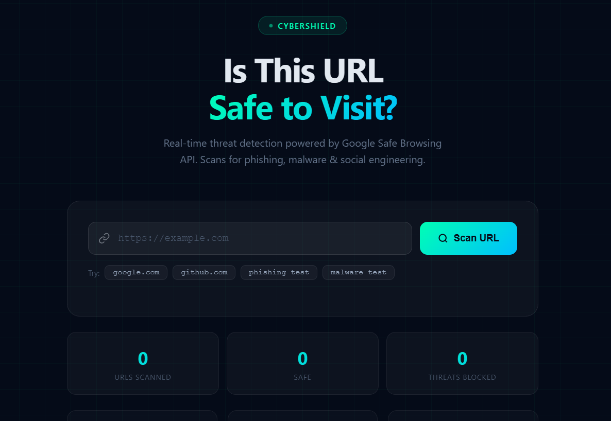
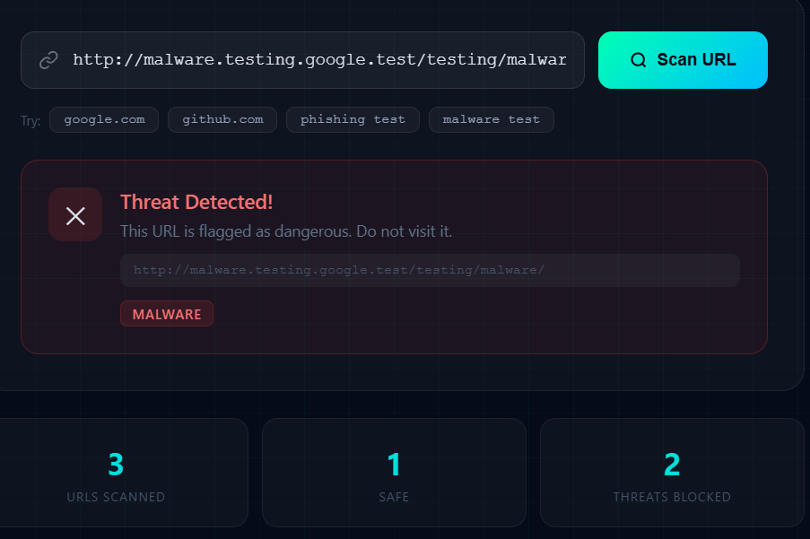

# 🛡️ CyberShield URL Scanner


🚀 **CyberShield** 
* **is a real-time URL security scanner that helps users detect whether a website is safe or potentially harmful before visiting it**.

🔗 **Live Demo:**
https://cybershield-url.netlify.app

---

## 📌 Features

* 🔍 **Real-time URL scanning**
* 🛡️ **Detects phishing, malware, and social engineering threats**
* ⚡ **Fast and responsive UI**
* 🌐 **Uses Google Safe Browsing API**
* ✅ **Simple and user-friendly interface**

---

## 🧠 How It Works


1. 🔗 **Enter URL**  
   The user inputs a website link into the scanner.

2. ⚡ **Send Request**  
   The application sends the URL to the security API.

3. 🛡️ **Threat Analysis**  
   Google Safe Browsing analyzes the URL for:
   - Phishing attacks  
   - Malware  
   - Social engineering threats  

4. 📊 **Display Result**  
   The system shows a clear result:
   - ✅ **Safe** — No threats detected  
   - ⚠️ **Potential Threat** — Risky or malicious content found  

---

---
---

## 🧠 Tech Stack

| Layer        | Technology |
|-------------|-----------|
| Frontend     | HTML5 |
| Styling      | CSS3 (Custom Properties, Responsive Design) |
| Logic        | JavaScript (Vanilla JS) |
| Backend      | Node.js (API Handling) |
| Security API | Google Safe Browsing API |
| Deployment   | Render / Netlify / GitHub Pages |

---
---

## 📸 Preview



---

## 🔑 API Integration

This project uses:

* Google Safe Browsing API

  * Detects malicious URLs
  * Requires API key from Google Cloud Console

---

## ⚙️ Setup Instructions

1. Clone the repository:

```bash
git clone https://github.com/mrinalray/Cybershield_URL.git
```

2. Navigate to project folder:

```bash
cd Cybershield_URL
```

3. Add your API key:

```js
const API_KEY = "YOUR_API_KEY";
```

4. Run locally:

* Open `index.html` in browser

---

## ⚠️ Important Notes

* Do NOT expose your API key publicly
* Use environment variables for production
* This is a client-side demo (for hackathon/project use)

---

## 🚀 Future Improvements

* 🔐 Email breach checker integration (HIBP API)
* 📊 Threat analytics dashboard
* 🌍 Browser extension support
* 🤖 AI-based threat detection

---

## 👨‍💻 Author

**Mrinal Roy**

* GitHub: https://github.com/mrinalray
  
**Rahul Sah**
  * GitHub: https://github.com/real-rahul1
  

---

## ⭐ Support

If you like this project:

* ⭐ Star the repo
* 🍴 Fork it
* 📢 Share with others

---

## 📜 License

This project is for educational and demonstration purposes.
