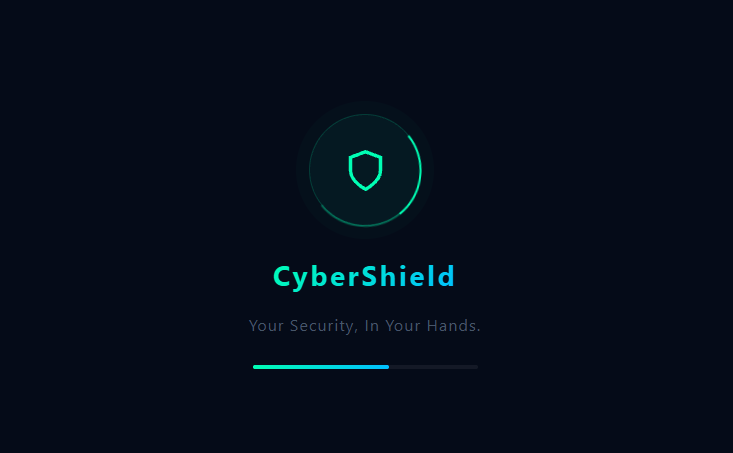

# 🛡️ CyberShield URL Scanner



🚀 **CyberShield** is a premium, real-time URL security scanner designed to provide instant protection against digital threats. Powered by the Google Safe Browsing API, it identifies phishing, malware, and social engineering risks with state-of-the-art accuracy and a modern, high-performance interface.

🔗 **Live Demo:** [https://cybershield-url.netlify.app](https://cybershield-url.netlify.app)

---

## 📌 Key Features

*   🔍 **Real-time Security Scanning**: Instant analysis of any URL against global threat databases.
*   🌓 **Dual Theme Support**: Beautifully designed **Dark Mode** (original Green-Blue theme) and **Light Mode** (vibrant Orange-Red theme) with persistent user preference.
*   🛡️ **Proactive Threat Detection**: Identifies phishing, malware, and deceptive site activities.
*   ✨ **Magic UI Experience**: Smooth animations, micro-interactions, and professional SVG iconography.
*   🧹 **Workflow Optimization**: "Clear Input" functionality and one-click examples for frictionless testing.
*   📊 **Live Statistics**: Real-time tracking of scan counts and detected threats.
*   👥 **Meet the Builders**: Interactive team section showcasing the developers behind the shield.

---

## 🧠 How It Works

1.  **Enter URL**: Input any link into the modernized scanner field.
2.  **API Handshake**: The system securely transmits the URL to the Google Safe Browsing backend.
3.  **Threat Intelligence**: Google's database analyzes the link for malicious patterns.
4.  **Visual Verdict**: 
    *   ✅ **Safe**: URL is cleared for visit.
    *   ⚠️ **Threat Detected**: Immediate warning with detailed threat category tags.

---

## 🛠️ Technology Stack

| Layer | Technology |
| :--- | :--- |
| **Frontend** | HTML5 (Semantic Structure) |
| **Styling** | CSS3 (Modern Flex/Grid, Variables, Theme System) |
| **Logic** | Vanilla JavaScript (ES6+, State Management) |
| **Backend** | Node.js / Express (Proxying API Requests) |
| **Security** | Google Safe Browsing API |

---

## ⚙️ Local Setup

1.  **Clone the Repository**:
    ```bash
    git clone https://github.com/mrinalray/Cybershield_URL.git
    cd Cybershield_URL
    ```

2.  **Install Dependencies**:
    ```bash
    npm install
    ```

3.  **Configure Environment**:
    - Create a `.env` file in the root directory.
    - Add your Google Safe Browsing API Key:
      ```env
      API_KEY=YOUR_SECURE_API_KEY
      ```

4.  **Launch the Application**:
    ```bash
    node server.js
    ```
    - Open `http://localhost:3000` in your browser.

---

## 🚀 Future Roadmap

*   🔐 **Data Breach Integration**: Cross-referencing emails with HIBP databases.
*   🌍 **Browser Extension**: Real-time protection while you browse.
*   🤖 **ML Analysis**: Local heuristic analysis for zero-day threat detection.
*   📱 **Mobile App**: Cross-platform security for iOS and Android.

---

## 👨‍💻 Development Team

*   **Mrinal Roy** ([GitHub](https://github.com/mrinalray))
*   **Rahul Sah** ([GitHub](https://github.com/real-rahul1))
*   **Swastika Shaw**
*   **Arpita Roy**
*   **Disha Samanta**

---

## 📜 License

This project is licensed under the MIT License. See [LICENSE.md](LICENSE.md) for details.

---

## ⭐ Support

If you find CyberShield useful:
*   ⭐ **Star** the repository on GitHub.
*   🍴 **Fork** the project to contribute.
*   📢 **Share** with your network to spread security awareness.
