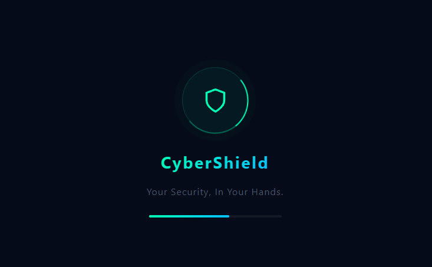
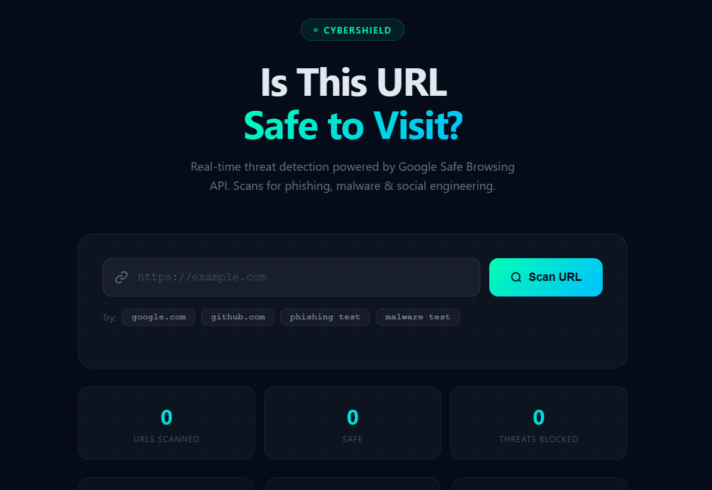
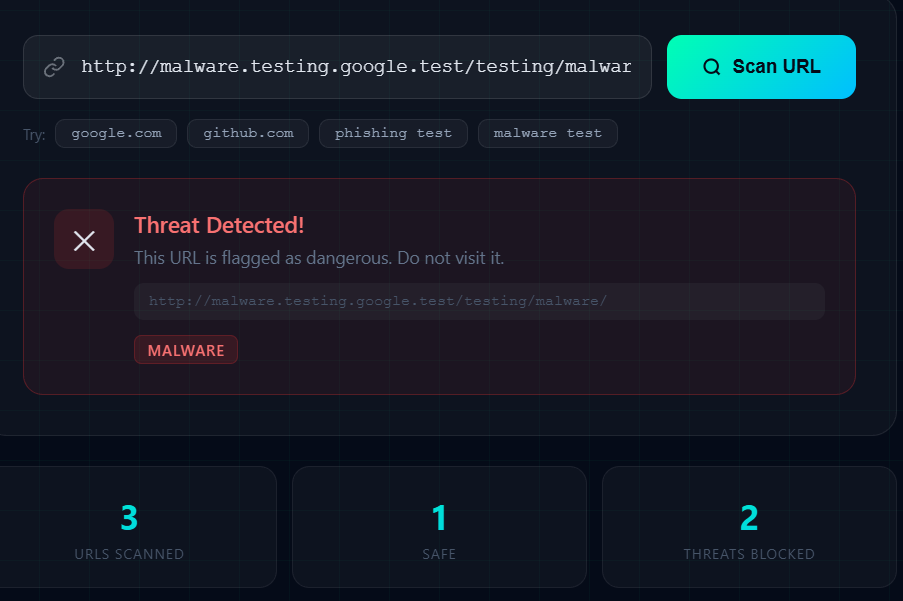

<div align="center">



# 🛡️ CyberShield URL Scanner

**Real-time URL security scanner — detect phishing, malware, and social engineering threats before you click.**

[](https://mrinalray.github.io/Cybershield_URL/)
[](LICENSE)
[](https://github.com/mrinalray/Cybershield_URL/graphs/contributors)
[](https://github.com/mrinalray/Cybershield_URL/stargazers)

</div>

---

## ✨ Features

| Feature | Description |
|---|---|
| 🔍 **Real-time URL Scanning** | Instant analysis against Google's threat database |
| 📸 **Screenshot Scanner** | Drag & drop screenshots — Gemini AI extracts URLs via OCR |
| 💬 **AI Scam Detector Chat** | Analyze suspicious emails, messages, or job pitches |
| 🛡️ **Threat Detection** | Phishing, malware, and social engineering threats |
| ⚡ **Fast & Responsive UI** | Clean interface with instant results |

---

## 🖼️ Preview




---

## 🧠 How It Works

```
 ┌─────────────────┐    ┌──────────────────┐    ┌──────────────────┐    ┌────────────────┐
 │  1. Enter URL   │───▶│  2. Send Request │───▶│  3. Threat Scan  │───▶│  4. Result     │
 │  or Screenshot  │    │  to Security API │    │  (Safe Browsing) │    │  ✅ Safe        │
 └─────────────────┘    └──────────────────┘    └──────────────────┘    │  ⚠️ Threat     │
                                                                          └────────────────┘
```

1. **Enter URL or Upload Screenshot** — Manually type a URL or drag & drop a screenshot. Gemini AI extracts the URL automatically via OCR.
2. **Send Request** — The app securely forwards the URL to Google Safe Browsing.
3. **Threat Analysis** — Scanned for phishing, malware, and social engineering in real time.
4. **Clear Result** — ✅ Safe (no threats) or ⚠️ Threat (malicious content found).

---

## 🧰 Tech Stack

<div align="center">


</div>

---

## 🔑 API Setup

<details>
<summary><b>🌐 Google Safe Browsing API</b></summary>

1. Go to [Google Cloud Console](https://console.cloud.google.com/)
2. Enable the **Safe Browsing API**
3. Navigate to **APIs & Services → Credentials** and generate a key
4. Save it as `API_KEY` in your `.env` file

</details>

<details>
<summary><b>🤖 Gemini API</b></summary>

1. Go to [Google AI Studio](https://aistudio.google.com/)
2. Click **Get API Key** and create a new key
3. Save it as `GEMINI_API_KEY` in your `.env` file

</details>

---

## ⚙️ Setup & Installation

```bash
# 1. Clone the repository
git clone https://github.com/mrinalray/Cybershield_URL.git
cd Cybershield_URL

# 2. Install dependencies
npm install

# 3. Configure environment variables
cp .env.example .env
# Open .env and fill in API_KEY and GEMINI_API_KEY

# 4. Start the backend
node server.js

# 5. Open frontend
# Open index.html in your browser
```

> ⚠️ **Never expose your API keys publicly.** Always use environment variables in production.

---

## 🚀 Roadmap

- [ ] 🔐 Email breach checker (HIBP API)
- [ ] 📊 Threat analytics dashboard with charts
- [ ] 🌍 Browser extension
- [ ] 🤖 AI-based threat detection
- [ ] 📤 Export scan logs for offline analysis

---

## 🤝 Contributors

<div align="center">

**A huge thank you to all the amazing people who have contributed to CyberShield! 💙**

<!-- readme: contributors-start -->
<!-- readme: contributors-end -->

<a href="https://github.com/mrinalray/Cybershield_URL/graphs/contributors">
  
</a>

<br/>

**Want to contribute?**  
Check out our [Contributing Guidelines](CONTRIBUTING.md) and submit a PR — your avatar gets added automatically! 🚀

</div>

---

## 👨‍💻 Authors

<table>
  <tr>
    <td align="center">
      <a href="https://github.com/mrinalray">
        <br/>
        <sub><b>Mrinal Roy</b></sub>
      </a>
    </td>
    <td align="center">
      <a href="https://github.com/real-rahul1">
        <br/>
        <sub><b>Rahul Sah</b></sub>
      </a>
    </td>
  </tr>
</table>

---

## ⭐ Support

If CyberShield helped you or you think it's cool:

[](https://github.com/mrinalray/Cybershield_URL/stargazers)
[](https://github.com/mrinalray/Cybershield_URL/fork)

---

<div align="center">
<sub>📜 This project is for educational and demonstration purposes.</sub>
</div>
